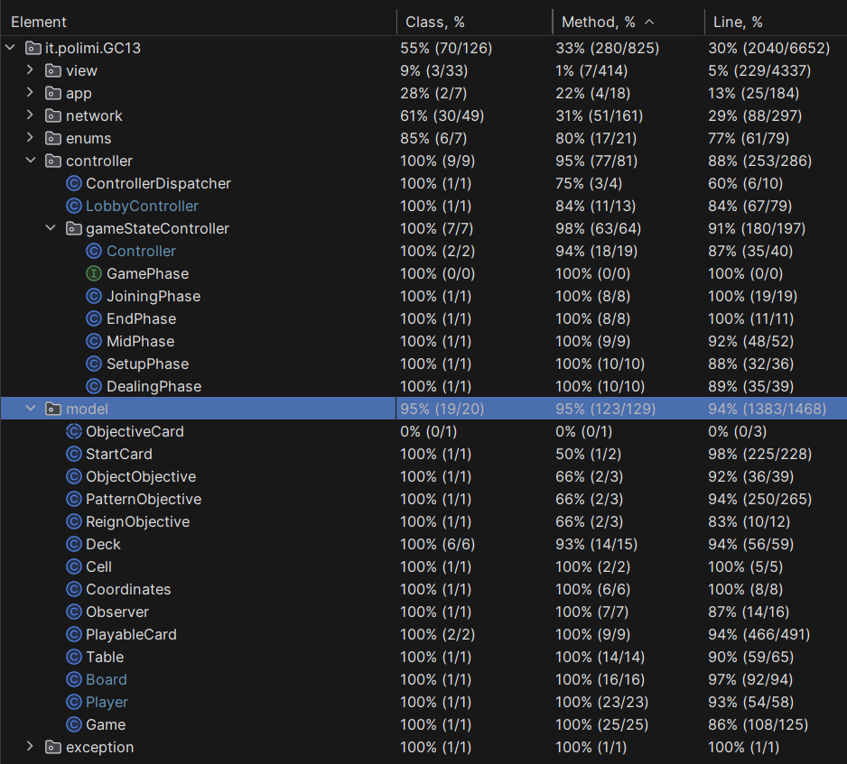

Codex Naturalis game is the final test of **"Software Engineering"**, course of **"Computer Science Engineering"** held at Politecnico di Milano (2023/2024).

You can find the full game [here](https://www.craniocreations.it/prodotto/codex-naturalis).

**Professor**: Prof. Gianpaolo Cugola

**Group**: GC13

**Students**:
- Alessandro Vitobello
- Niccolò Sobrero
- Pietro Venturelli
- Riccardo Rivoltella

## Project Specification
The project consists of a Java version of the board game *Codex Naturalis*, made by Cranio Creations, according to the game rulebook [italian version](src/main/resources/CODEX_ITA_Rules_compressed.pdf).

The program is realized following a Model-View-Controller design pattern: several UML diagrams are provided to clarify the structure and dynamics of the code.

Project requirements are available [here](src/main/resources/requirements.pdf).

## Implemented features

| Feature                  | Implemented                                                                      |
|--------------------------|----------------------------------------------------------------------------------|
| All the rules            | ✅                                                                 |
| TUI                      | ✅                                                                 |
| GUI                      | ✅                                                                 |
| Socket                   | ✅                                                                |
| RMI                      | ✅                                                                |
| Advanced functionality 1 | ✅ Multiple matches                     |
| Advanced functionality 2 | ⛔ Resilience to disconnections  |
| Advanced functionality 3 | ✅ Chat                                                            |
| Advanced functionality 4 | ✅ Persistence                                                            |

## How to run the game
Download the jar files from [here](https://1drv.ms/f/s!AojSp3-Z0yGVpx7XgWVWGXNQL_rx?e=e5FrGE)
### Server
To execute Server please run the following command
```
java -jar Server.jar rmiPort socketPort 
```
where:
* ```rmiPort ``` : RMI port number.
* ```socketPort ``` : Socket port number.

Please, note that RMI port and socket port have to be different.

### Client
To execute Client please run the following command
```
java -jar Client.jar ServerAdress rmiport socketport
```
where:
* ``` ServerAddress ``` : IP address of the server you intend to connect.
* ```rmiPort ``` : RMI port number of the server.
* ```socketPort ``` : Socket port number of the server.

## UML diagrams
The structure of the whole system is displayed by different UMLs. In the `Deliveries/UML` directory, there are two subdirectories:
1. `HandcraftedUML` which contains the initial handcrafted diagrams, such as:
    - [model-controller-network class diagram](Deliveries/UML/HandcraftedUML/UML_controller_model_network.pdf);
    - [network sequence diagrams](Deliveries/UML/HandcraftedUML).
2. `FinalUML` which contains the [final diagrams](Deliveries/UML/FinalUML), generated from the code by automated tools.

## Testing
The tests achieved the following coverage:

   


## JavaDoc
The following documentation includes a description of all classes and methods: [javadoc](Deliveries/Javadoc).

## Libraries and Plugins
| Library/Plugin  | Description                                                                   |
|-----------------|-------------------------------------------------------------------------------|
| __Maven__       | A build automation tool used primarily for Java projects.                     |
| __javax.swing__ | A Java library that is used to develop Desktop applications                   |
| __JUnit__       | A unit testing framework for Java programming language.                       |
| __Gson__        | A simple Java-based library to serialize Java objects to JSON and vice versa. |


## License
[Codex Naturalis](https://www.craniocreations.it/prodotto/codex-naturalis) is property of [Cranio Creations](https://www.craniocreations.it) and all the copyrighted graphical assets used in this project were supplied by [Politecnico di Milano](https://www.polimi.it) in collaboration with their rights' holders.
